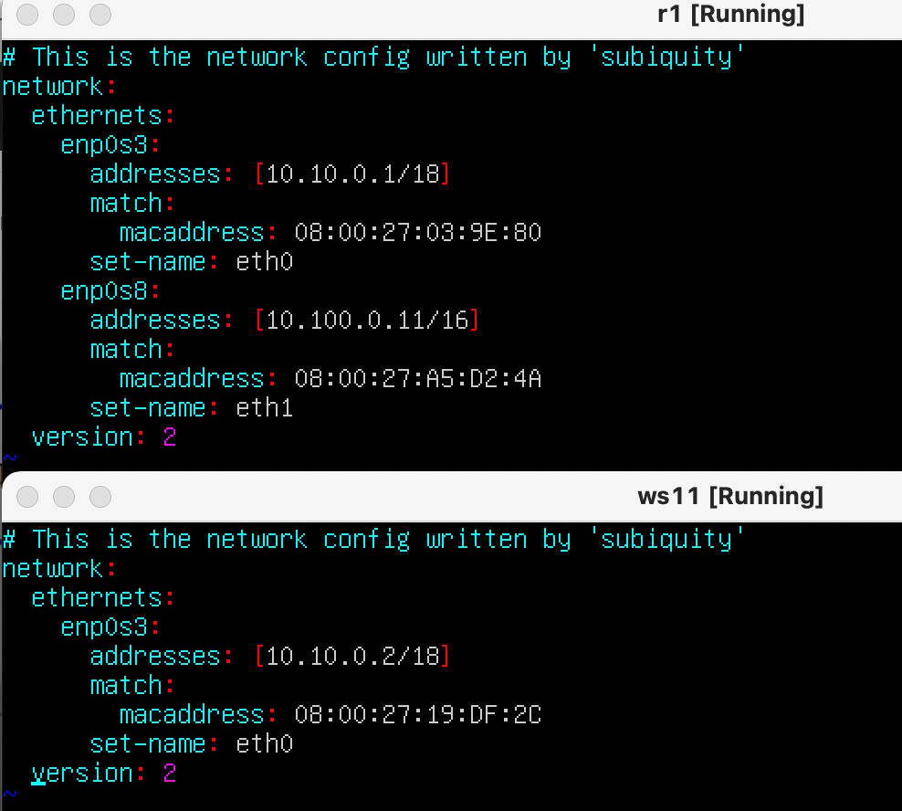
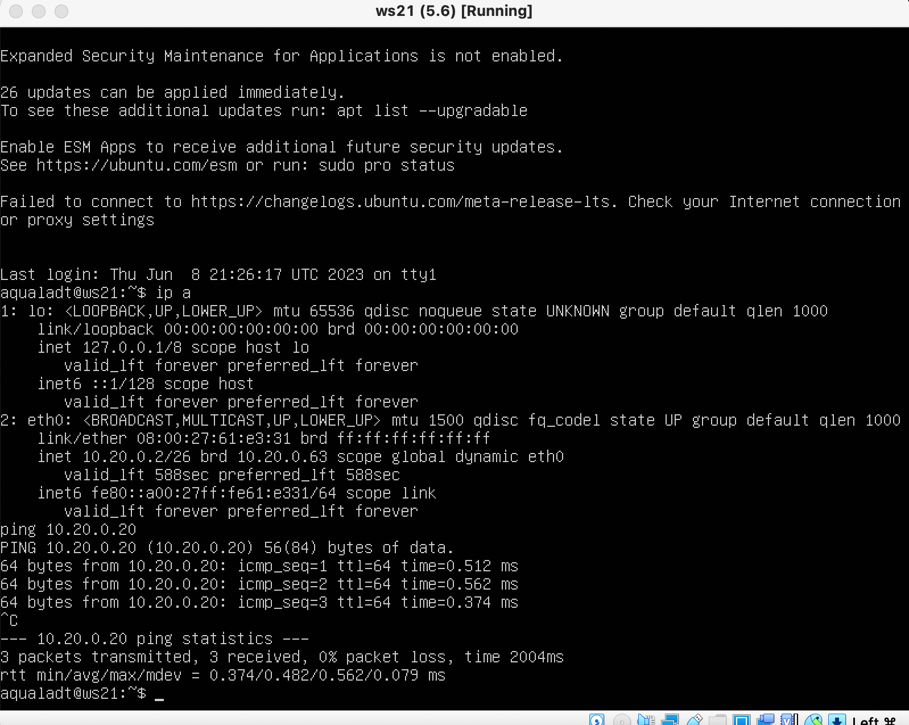

## Статическая маршрутизация между двумя машинами

- Поднимаем две виртуальные машины (далее -- ws1 и ws2).
С помощью команды ip a смотрим существующие сетевые интерфейсы

- Описываем сетевой интерфейс, соответствующий внутренней сети, на обеих машинах и задаем следующие адреса и маски: ws1 - 192.168.100.10, маска /16, ws2 - 172.24.116.8, маска /12

- Выполняем команду `netplan apply` для перезапуска сервиса сети
  

### Добавление статического маршрута вручную

- Добавляем статический маршрут от одной машины до другой и обратно при помощи команды вида ip r add.
Для проверки пропингуем соединение между машинами

### Добавление статического маршрута с сохранением

- Добавляем статический маршрут от одной машины до другой с помощью файла etc/netplan/00-installer-config.yaml

- Пропинговываем соединение между машинами

## Утилита iperf3

- Для измерения скорости на одной машине запускаем утилиту в серверном режиме (iperf3 –s), а на другой запускаем проверку со стороны клиента (iperf3 –с 172.24.116.8)
- Transfer – размер переданных данных за это время
- Bitrate – средняя скорость передачи данных

## Сетевой экран

### Утилита iptables

- Добавляем в файл фаервола подряд следующие правила:

1) на ws1 применить стратегию когда в начале пишется запрещающее правило, а в конце пишется разрешающее правило (это касается пунктов 4 и 5)

2) на ws2 применить стратегию когда в начале пишется разрешающее правило, а в конце пишется запрещающее правило (это касается пунктов 4 и 5)

3) открыть на машинах доступ для порта 22 (ssh) и порта 80 (http)

4) запретить echo reply (машина не должна "пинговаться”, т.е. должна быть блокировка на OUTPUT)

5) разрешить echo reply (машина должна "пинговаться")

- Запускаем файлы на обеих машинах командами `chmod +x /etc/firewall.sh` и `/etc/firewall.sh`

- Разница стратегий в порядке установки правил - выполнение идет всегда сверху вниз, поэтому в одном случае машина не пингуется, т.к. есть запрет на output после разрешения на output

### Утилита nmap

- Командой ping найдем машину, которая не "пингуется", после чего утилитой nmap покажем, что хост машины запущен

## Статическая маршрутизация сети

### Настройка адресов машин

- Настраеваем конфигурации машин в etc/netplan/00-installer-config.yaml согласно сети на рисунке.
  
- Настройка машин ws21, ws22, r2

- Настройка машин r1, w11

- Проверка командой ip -4 a, что адрес машины задан верно
- Для машин ws21, ws22, r2. Также пропингуем ws22 с ws21

- Для машин r1 и ws11. Также пропингуем r1 с ws11.

### Включение переадресации IP-адресов.
- Для включения переадресации IP, выполняем команду на роутерах:
  `sysctl -w net.ipv4.ip_forward=1`

- Откроем файл /etc/sysctl.conf и добавим в него следующую строку:
  `net.ipv4.ip_forward = 1`

### Установка маршрута по-умолчанию
- Настроим маршрут по-умолчанию (шлюз) для рабочих станций. Для этого добавим default перед IP роутера в файле конфигураций

- Вызовем ip r и покажем, что добавился маршрут в таблицу маршрутизации

- Пропингуем с ws11 роутер r2 и покажем на r2, что пинг доходит. Для этого используем команду:
  `tcpdump -tn -i eth1`
- Машина ws11 и роутер r2 пинговаться не будут, так как мы не прописали для этого маршруты (это будет далее).
Так же при пинге с ws11 на r2 на интерфейсе eth1 мы не увидим пакетов, т.к. они вернутся через eth0.
На скриншоте результат команды после того, как были прописаны маршруты (пинг есть, eth1 пакеты не получает)

### Добавление статических маршрутов

- Добавляем в роутеры r1 и r2 статические маршруты в файле конфигураций.
  
- Вызвем ip r и покажем таблицы с маршрутами на обоих роутерах.
  
- Запустим команды на ws11:
  `ip r list 10.10.0.0/[маска сети]` и `ip r list 0.0.0.0/0`
  
- Для адреса 10.10.0.0/18 был выбран маршрут, отличный от 0.0.0.0/0, т.к. он лежит внутри сети и сначала будет поиск хоста в этой сети, а 0.0.0.0 не принадлежит этой сети и сразу поиск идет через маршрут по умолчанию 

### Построение списка маршрутизаторов

- Запустим на r1 команду дампа:
  `tcpdump -tnv -i eth0`
  
- 
- При помощи утилиты traceroute построим список маршрутизаторов на пути от ws11 до ws21
  
- Принцип работы построения пути при помощи traceroute:
1) Для выяснения промежуточных маршрутизаторов traceroute отправляет указанному узлу пакеты, каждый раз увеличивая время их жизни (TTL) на 1 (начиная с TTL=1)
2) При достижении первого пакета первым маршрутизатором, пакет уничтожаетсся, а обратно возвращается сообщение "time exceeded in-transit". Отправляется по 3 пакета на случайны порт.
3) TTL следующего пакета становится 2. При достижении пакетом первого маршрутизатора, он проходит дальше, до второго и т.д.
4) Процесс продолжается до тех пор, пока пакет не достигает указанного узла.
5) Утилита завершает работу, когда получает от указанного узла сообщение, что порт недоступен

### Использование протокола ICMP при маршрутизации

- Запустим на r1 перехват сетевого трафика, проходящего через eth0 с помощью команды:
  `tcpdump -n -i eth0 icmp`
- Пропингуем с ws11 несуществующий IP (например, 10.30.0.111) с помощью команды:
  `ping -c 1 10.30.0.111`
  

## Динамическая настройка IP с помощью DHCP

- Для r2 настроим в файле /etc/dhcp/dhcpd.conf конфигурацию службы DHCP:
1) укажем адрес маршрутизатора по-умолчанию, DNS-сервер и адрес внутренней сети.

2) в файле resolv.conf пропишем nameserver 8.8.8.8.

- Перезагрузим службу DHCP командой `systemctl restart isc-dhcp-server`.
  
- Меняем конфигурацию машины на `dhcp4: true`
  
- Машину ws21 перезагрузим при помощи reboot и через ip a покажем, что она получила адрес. Также пропингуем ws22 с ws21.

- Укажем MAC адрес у ws11, для этого в etc/netplan/00-installer-config.yaml надо добавить строки: `macaddress: 10:10:10:10:10:BA`, `dhcp4: true`
  
- Для r1 настроим аналогично r2, но сделаем выдачу адресов с жесткой привязкой к MAC-адресу (ws11).
  
- Проведем аналогичные тесты
  
- Запросим с ws21 обновление ip адреса
- До обновления
  
- После обновления
  
- В данном пункте пользовались следующими опциями DHCP сервера - маска подсети, основной шлюз,

## NAT

- В файле /etc/apache2/ports.conf на ws22 и r1 изменим строку Listen 80 на Listen 0.0.0.0:80, то есть сделаем сервер Apache2 общедоступным

- Запустим веб-сервер Apache командой service apache2 start на ws22 и r1

- Добавим в фаервол, на r2 следующие правила:
1) удаление правил в таблице filter - iptables -F
2) удаление правил в таблице "NAT" - iptables -F -t nat
3) отбрасывать все маршрутизируемые пакеты - iptables --policy FORWARD DROP. Проверить соединение между ws22 и r1 командой ping

  
4) разрешить маршрутизацию всех пакетов протокола ICMP. Проверить соединение между ws22 и r1 командой ping
   
5) включить SNAT, а именно маскирование всех локальных ip из локальной сети, находящейся за r2 (по обозначениям из Части 5 - сеть 10.20.0.0)
6) включить DNAT на 8080 порт машины r2 и добавить к веб-серверу Apache, запущенному на ws22, доступ извне сети
- Проверить соединение по TCP для SNAT, для этого с ws22 подключиться к серверу Apache на r1 командой:
  `telnet [адрес] [порт]`
- Проверить соединение по TCP для DNAT, для этого с r1 подключиться к серверу Apache на ws22 командой telnet (обращаться по адресу r2 и порту 8080)
  
- 
## Знакомство с SSH Tunnels

- Запустим на r2 фаервол с правилами из Части 7
- Запустим веб-сервер Apache на ws22 только на localhost (то есть в файле /etc/apache2/ports.conf изменить строку Listen 80 на Listen localhost:80)
  
- Воспользуемся Local TCP forwarding с ws21 до ws22, чтобы получить доступ к веб-серверу на ws22 с ws21
  
- Воспользуемся Remote TCP forwarding c ws11 до ws22, чтобы получить доступ к веб-серверу на ws22 с ws11
  
- 
- Для проверки, сработало ли подключение в обоих предыдущих пунктах, перейдем во второй терминал (например, клавишами Alt + F2) и выполним команду:
  `telnet 127.0.0.1 [локальный порт]`
  

